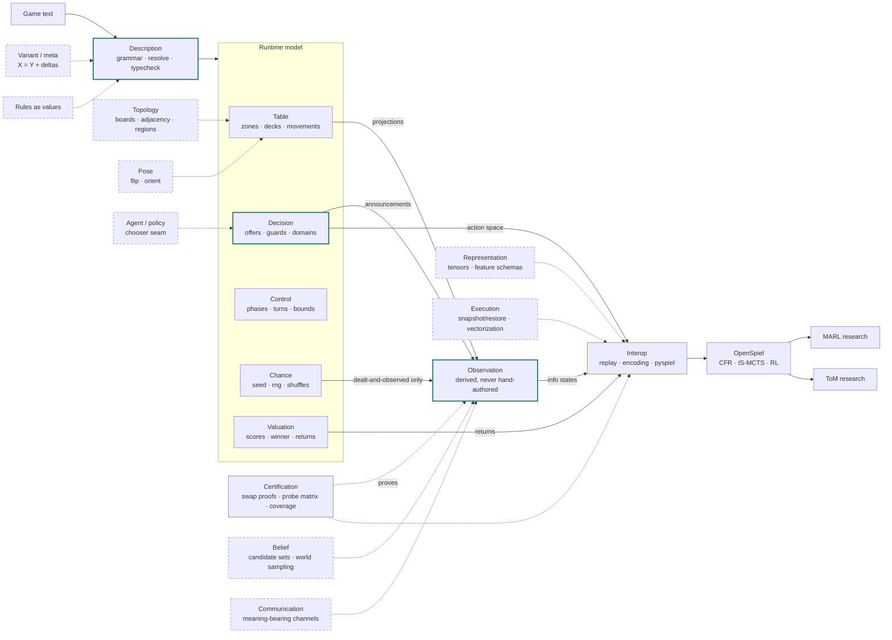

# The engine's domain map

Orientation for the engine's bounded contexts — what exists, how data flows
between them, and where the long-horizon goals (boards, theory-of-mind
research, MARL) dock new domains. This is a map, not spec:
[decisions.md](../decisions.md) wins on any conflict, and the axis arguments
live in [generalization-path.md](generalization-path.md) — this note only
places them. **Maintenance rule:** update this note in the same change that
lands or re-scopes a domain; between such changes it does not churn. A
polished rendering can be regenerated from this note on demand — this file
is the single source of truth.

## The map

Solid arrows are today's data flow; dashed arrows dock a future domain at
its anchor. Everything flows through Observation — the derived-information-
set moat — and no planned domain changes it, which is the sign the core
abstraction is right.

## Existing domains

| Domain | In plain terms | Registry / anchor |
|---|---|---|
| **Description** (core) | The language: text → checked program | grammar productions; AST unions; diagnostics; the totality walls |
| **Table** | Where physical things are | zone types + `ZONE_PROJECTIONS`; `DECKS` |
| **Decision** (core) | Who may do what, when | move types + guards; declared parameter domains; `ActionSpace` |
| **Observation** (core, the moat) | Who knows what — derived from declared visibility, never authored per game | event vocabulary; projection lattice; per-observer logs; `information_state` |
| **Control** | When things happen; termination | round forms; seating; `max_length` |
| **Valuation** | What outcomes are worth | `winner:`; `returns_for` |
| **Chance** | What randomness does | the root seed; every rng draw site |
| **Interop** | Anti-corruption layer to OpenSpiel | replay `(seed, history)`; encoding; registration |
| **Certification** (supporting) | Evidence about the engine itself | the proof battery; `ZONE_PROBES`; coverage records |

Description + Decision + Observation are the core domain — derived
information sets are why this engine beats hand-coding games. Each domain's
closed registries carry the
[closed-domain completeness](../decisions.md) obligations.

## Future domains: anchor and forcing witness

| Domain | Attaches to | What forces it |
|---|---|---|
| Topology | Table | First solitaire (Klondike/FreeCell), then a real board: adjacency, lines, region/connectivity queries ([generalization-path](generalization-path.md), axis 1) |
| Pose | Table | Double-sided / orientation-aware pieces: one new verb (`flip`/`orient`) emitting observations like any movement (axis 2) |
| Belief | Observation | Determinization for IS-MCTS and who-knows-what studies: candidate sets as queryable data, world enumeration — one mechanism, two consumers |
| Communication | Observation | LLM player seats ([llm-player-seats](llm-player-seats.md)) and convention-bearing bids: meaning in channels, outside today's structured partition |
| Representation | Interop | `information_state_tensor` (the roadmap's recorded prize); feature schemas as versioned contracts |
| Execution | Interop | RL-scale throughput: replay is O(n²) re-simulation today; snapshot/restore must preserve replay purity |
| Agent / policy | Decision seam | Representative playouts and real policies at the chooser seam; seat vs agent identity; richer reward structure |
| Variant / meta | Description | "X is Y with deltas": MARL curricula and ToM minimal pairs (two games differing in one visibility declaration) from programmatic families |
| Rules as values | Description | Selectable rule sets at runtime (axis 3); effect composition (CCGs) stays the horizon beyond it (axis 4) |

Every future domain arrives under the closed-domain-completeness bar: with
its defining registry, its static pins, and its walls on day one —
topology's adjacency relations, pose's verb set, and the tensorizer's
feature schema are all closed domains from birth.
