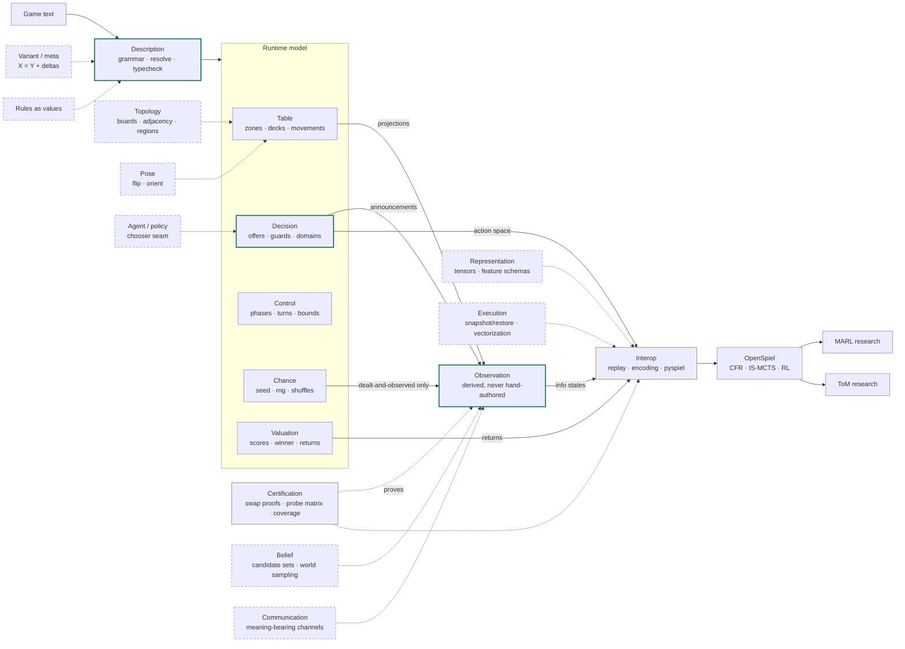

# The engine's domain map

Orientation for the engine's bounded contexts — what exists, how data flows
between them, and where the long-horizon goals (boards, theory-of-mind
research, MARL) dock new domains. This is a map, not spec:
[decisions.md](../decisions.md) wins on any conflict, and the axis arguments
live in [generalization-path.md](generalization-path.md) — this note only
places them. **Maintenance rule:** update this note in the same change that
lands or re-scopes a domain; between such changes it does not churn. A
polished rendering can be regenerated from this note on demand — this file
is the single source of truth.

## The map

Solid arrows are today's data flow; dashed arrows dock a future domain at
its anchor. Everything flows through Observation — the derived-information-
set moat — and no planned domain changes it, which is the sign the core
abstraction is right.

## Existing domains

| Domain | In plain terms | Registry / anchor |
|---|---|---|
| **Description** (core) | The language: text → checked program | grammar productions; AST unions; diagnostics; the totality walls |
| **Table** | Where physical things are | zone types + `ZONE_PROJECTIONS`; `DECKS` |
| **Decision** (core) | Who may do what, when | move types + guards; declared parameter domains; `ActionSpace` |
| **Observation** (core, the moat) | Who knows what — derived from declared visibility, never authored per game | event vocabulary; projection lattice; per-observer logs; `information_state` |
| **Control** | When things happen; termination | round forms; seating; `max_length` |
| **Valuation** | What outcomes are worth | `winner:`; `returns_for` |
| **Chance** | What randomness does | the root seed; every rng draw site |
| **Interop** | Anti-corruption layer to OpenSpiel | replay `(seed, history)`; encoding; registration |
| **Certification** (supporting) | Evidence about the engine itself | the proof battery; `ZONE_PROBES`; coverage records |

Description + Decision + Observation are the core domain — derived
information sets are why this engine beats hand-coding games. Each domain's
closed registries carry the
[closed-domain completeness](../decisions.md) obligations.

## Where each domain lives in code, and its completeness checks

The code is laid out by pipeline stage (front end → runtime → adapter), not
folder-per-domain — this table is the ownership map. **Placement
convention:** domain logic lives with its consumer when its output IS the
boundary contract — which is why the Observation renderer
(`openspiel/infostate.py`), Valuation's `returns_for`
(`openspiel/replay.py`), and Decision's `ActionSpace`
(`openspiel/encoding.py`) sit in the Interop package: their artifacts (the
info-state string, the returns vector, the action ids) are the OpenSpiel
contract itself. Do not "fix" their location.

| Domain | Code | Completeness checks (the pins) |
|---|---|---|
| Description | `grammar/`, `parse.py`, `ast/nodes.py`, `resolve.py`, `typecheck.py`, `ir.py` | Surface-totality matrices (movement grid, rejection tests); closed AST unions under `mypy --strict` with `assert_never` dispatches; declared-type-name and named-arg rejections |
| Table | `runtime/values.py`, `runtime/state.py`, `stdlib/zones.py` | `ZONE_PROBES` ↔ `ZONE_PROJECTIONS` pin + probe-time refusal; deck registries derived from `DECKS` (suits) or drift-pinned (sizes); emission-rule raise in `view_of` |
| Decision | `runtime/mechanics.py`, `runtime/chooser.py`, `runtime/execute.py` (offer), `openspiel/encoding.py` | `enumerate_domain` ↔ `_FIXED_DOMAINS` pin; registry→dispatcher pins (`STDLIB_CALL_FUNCS`, `ZONE_METHODS`); encoder ends in loud errors |
| Observation | `runtime/observe.py`, `openspiel/infostate.py` | `EVENT_TYPES` vocabulary + corpus-sweep pin; renderer shape walls (undeclared value shapes refuse); the partition proof battery |
| Control | `runtime/driver.py`, `runtime/phases.py` | Central decision counting vs `max_length` (one wrapper, every chooser site); round-form surface under Description's totality |
| Valuation | `openspiel/replay.py` (`returns_for`), driver winner handling | Bounded by the `winner:` grammar surface; per-game playout + conservation tests |
| Chance | seeded in `runtime/driver.py`, carried as `rs.rng` | The seed/rng non-observability pin; replay purity (chooser makes no rng calls) |
| Interop | `cardlang/openspiel/` (`game.py`, `replay.py`, `encoding.py`, `report.py`) | Per-game conformance; adapter-agreement proof (doubles as per-game determinism) |
| Certification | `tests/openspiel_ready/` | Self-pinning: `test_coverage.py` (modules ↔ registry, both directions), probe-table completeness pin, coverage records |

When new work touches a domain, its pins are the acceptance floor: extend
the registry and the pins in the same change, per closed-domain
completeness.

## Future domains: anchor and forcing witness

| Domain | Attaches to | What forces it |
|---|---|---|
| Topology | Table | First solitaire (Klondike/FreeCell), then a real board: adjacency, lines, region/connectivity queries ([generalization-path](generalization-path.md), axis 1) |
| Pose | Table | Double-sided / orientation-aware pieces: one new verb (`flip`/`orient`) emitting observations like any movement (axis 2) |
| Belief | Observation | Determinization for IS-MCTS and who-knows-what studies: candidate sets as queryable data, world enumeration — one mechanism, two consumers |
| Communication | Observation | LLM player seats ([llm-player-seats](llm-player-seats.md)) and convention-bearing bids: meaning in channels, outside today's structured partition |
| Representation | Interop | `information_state_tensor` (the roadmap's recorded prize); feature schemas as versioned contracts |
| Execution | Interop | RL-scale throughput: replay is O(n²) re-simulation today; snapshot/restore must preserve replay purity |
| Agent / policy | Decision seam | Representative playouts and real policies at the chooser seam; seat vs agent identity; richer reward structure |
| Variant / meta | Description | "X is Y with deltas": MARL curricula and ToM minimal pairs (two games differing in one visibility declaration) from programmatic families |
| Rules as values | Description | Selectable rule sets at runtime (axis 3); effect composition (CCGs) stays the horizon beyond it (axis 4) |

Every future domain arrives under the closed-domain-completeness bar: with
its defining registry, its static pins, and its walls on day one —
topology's adjacency relations, pose's verb set, and the tensorizer's
feature schema are all closed domains from birth.

## Pressure points and tripwires

Where corpus growth actually lands, and the signal that says stop and
design rather than accrete:

- **Card games** mostly grow registries inside existing domains (decks,
  stdlib primitives, round axes) — the drilled, pinned path. The first
  genuinely new pressure: observer-dependent phase outcomes (500's open
  misère, Belote's declarations —
  [knowledge-events](../open-questions/knowledge-events.md)).
- **Position explosion** (Table): a game file hand-enumerating cells
  (`square_a1 …`) is the nullary-explosion wall again — boards need
  position-indexed zones and an adjacency relation *derived* from a board
  declaration, never hand-written per game.
- **Connectivity escape hatch** (Description): a game-local Python
  primitive computing over geometry (captures, regions, longest-road) is
  the escape-hatch pattern returning; transitive-closure queries hit three
  instances almost immediately, so they become query surface early.
- **Per-object visibility** (Observation — the one moat-level risk):
  a piece whose position is public but identity is hidden (Stratego-class)
  pushes projections from per-zone to per-object-attribute. Its own
  workstream with the partition proofs as acceptance, not an extension.
  Its combat reveals (public functions of hidden state) are likely the
  compound hidden-function probe that unblocks
  [structural-infoset-proofs](../open-questions/structural-infoset-proofs.md)
  — budget both together.
- **In-play dice** (Chance + Interop): today all randomness folds into the
  root seed; the first roll-the-dice game forces explicit mid-game chance
  nodes — a replay-model change, not a registry entry.
- **Unbounded lines become the norm** (Control): chess-like games make
  [unbounded-lines-and-max-length](../open-questions/unbounded-lines-and-max-length.md)
  urgent, and their repetition rules need state *history*, which the
  engine does not track. Settle before the first open-ended board game.
- **The stillness test:** the observation substrate, info-state
  derivation, certification, and Valuation should not move. A design that
  requires changing how information states derive is a moat-level event —
  stop and sign it off, never fold it into a game PR.
